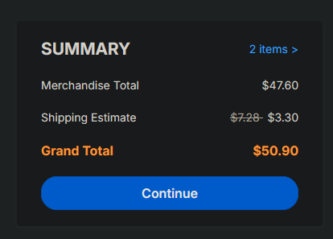
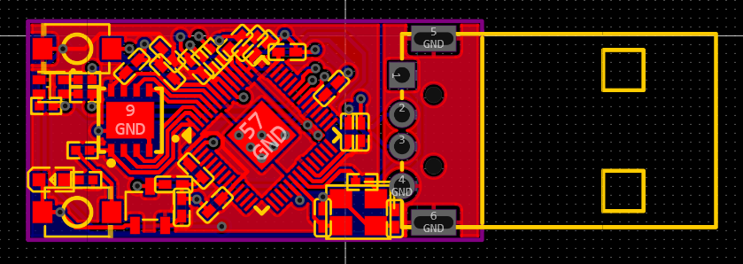
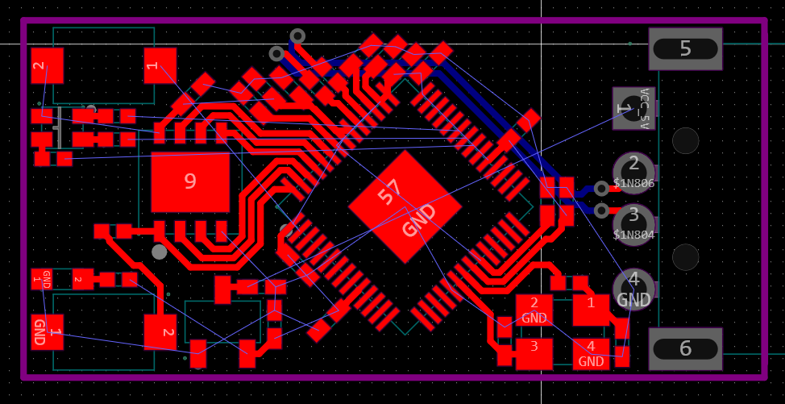
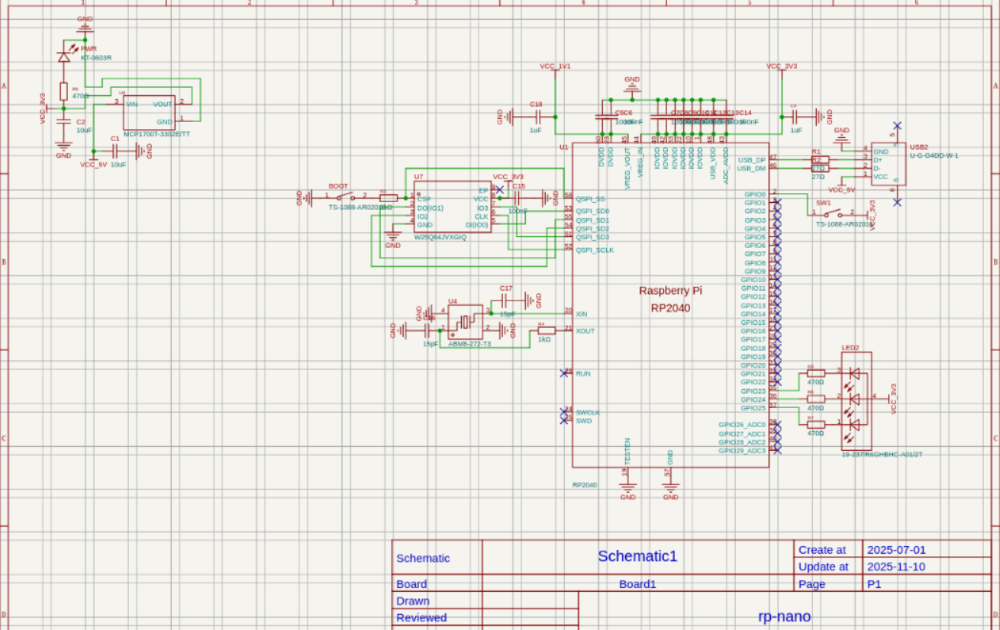

# (0.5 hours) Minor PCB changes and quote from JLCPCB

I made some minor changes to the power routing on my PCB, and got a quote from JLCPCB, and got all the files ready to submit, ill toss them in a repo, hoping to get this submitted tonight.

# (5.0 hours) Finished routing

My power routing is insanely cursed, but everything is routed, DRC passes, and I think it'll work. Next I'll go upload it to JLCPCB, and see how the price looks.

# (3.0 hours) Component placment and basic routing

Took forever, but I finalized the schematic, and I think the component placement is finalized. I've routed essential stuff, and I'm working on power/gnd etc.

# (5.0 hours) big schematic changes

Spent a lot of time going through datasheets, and ended up making a lot of big changes from the RP2040 design guide schematic that v1 was based on. It now has an RGB LED in addition to the power LED. Smaller flash chip (XSON package), at the cost of having only 64 Mbit flash now (still double the standard pico flash), and smaller LDO, only sourcing 250mA, which according to the rp2040 datasheet is more than enough. Also using an actual USB connector instead of thje PCB USB connector of v1.

