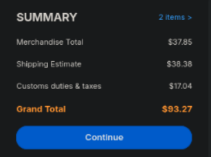
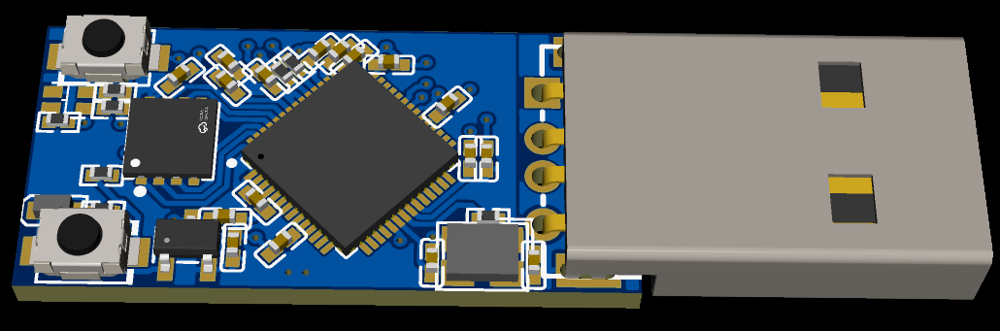
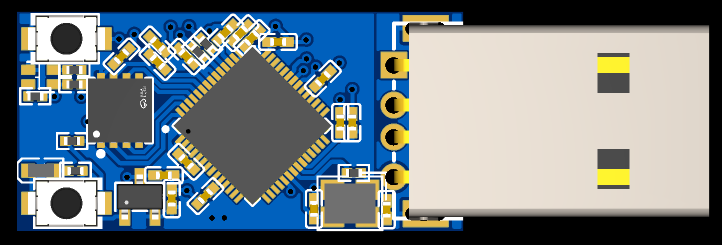
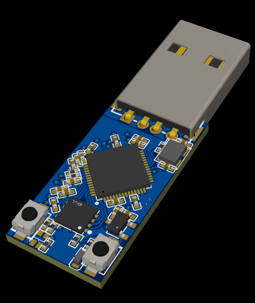
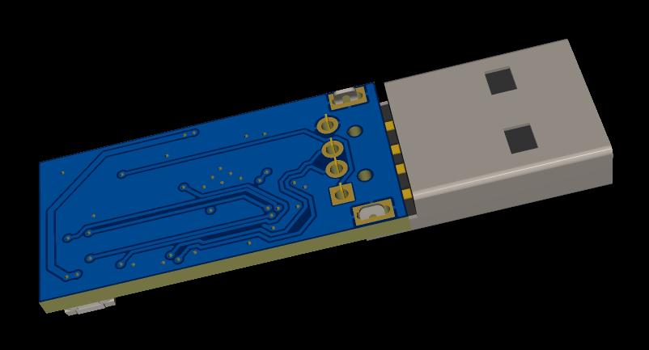
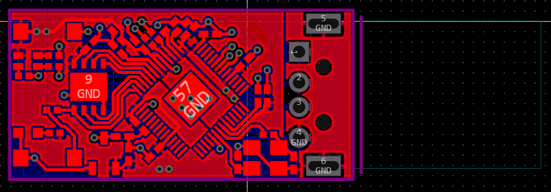
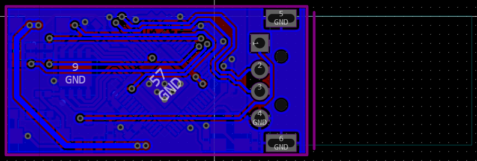

# rp-nano-2

## Version two of [rp-nano](https://github.com/TheTridentGuy/rp-nano), a small rp2040 USB dev board.

The last version of this board used the wrong LDO, and used a 4 layer PCB. This time, I designed it in 2 layers, and swapped the second LED for an RGB LED. Aditionally, it has been downsized, at the cost of now only having 64 Mbits of flash (still double the official RaspberryPi Pico). The LDO was also downsized, though it had previously been unecessarily large, and this will not affect the board. The previous PCB USB connector has been swapped with an actual soldered USB connector.

### PCB:

### Firmware:
https://circuitpython.org/board/raspberry_pi_pico/

### BOM:
**Item**|**Qty**|**Price each**|**Item total**|**Running total**
:-----:|:-----:|:-----:|:-----:|:-----:
PCBs (5xPCB 2xAssembly)|1|$55|$55|$55
